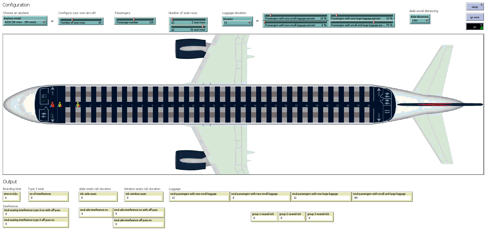

Recordings of the simulations presented in 
### **"Grey Clustering of the Variations in the Back-to-front Airplane Boarding Method Considering COVID-19 Flying Restrictions"** 
submitted to the `Sustainability` journal.

Please feel free to contact us at liviu.cotfas at ase .ro for further details. 

## Boarding Scenarios

All the simulations have been performed using the following settings:
- occupancy level: 100% (120 passengers);
- luggage situation: S1 (described in our paper);
- aisle distancing: 1.0m.

> Suggestions: 
> 1. You can download the animations below in order to watch them at a higher resolution.
> 2. Click on the animations to view it at a better resolution.

### 1. g1 = 2; g2 = 26; g3 = 2

### 2. g1 = 15; g2 = 10; g3 = 5

### 3. g1 = 10; g2 = 10; g3 = 10
